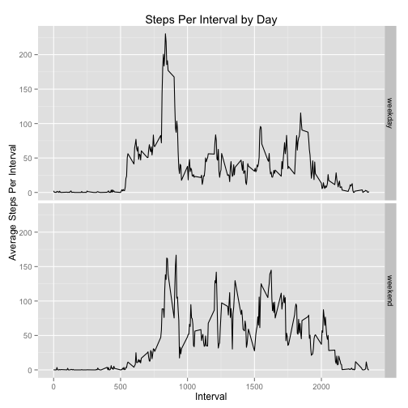

# Reproducible Research: Peer Assessment 1

The following analysis takes data from a Fitbit step tracker belonging to 
an anonymous participant and answers a variety of questions about that 
individuals walking behavior during that time period.

The raw data includes the total number of steps taken in a 5 minute
period, the identifier of that period, as 0, 5, 10, 15, etc, and the
Date.

## Loading and preprocessing the data

Our first step is to load the file and do some basic transforms to the data.

This code assumes that activity.zip is located in the current working directory
for the project.

```r
unzip('./activity.zip')
data <- read.csv('./activity.csv');
data <- transform(data, date = as.Date(date), interval = factor(interval))
```

## What is mean total number of steps taken per day?
Next, we'll take a look at the average number of steps per day.

Note that because some days had no steps, we simply remove the NAs from the
initial calculation done here.


```r
library(stats)
stepsPerDay <- tapply(data$steps, data$date, sum, na.rm=TRUE)
meanSteps <- mean(stepsPerDay, na.rm=TRUE)
medianSteps <- median(stepsPerDay, na.rm=TRUE)
hist(stepsPerDay, breaks=8, main="Number of steps per day", xlab="Steps Per Day")
```

 

The mean number of steps taken per day during this period is **9354.2295** 
and the median number is **10395**.

## What is the average daily activity pattern?

Next, we take a look at the patterns of behavior averaged over each
five minute interval.

The same process is taken to simply remove the empty values at this point.


```r
stepsPerInterval <- tapply(data$steps, data$interval, mean, na.rm=TRUE)
maxInterval <- names(which.max(stepsPerInterval))
plot(levels(data$interval), stepsPerInterval, type="l", 
     main="Average Steps Per Interval",
     ylab="Average number of Steps", xlab="Interval")
```

 

The maximum average number of steps occurs at interval **835**

## Imputing missing values

Due to the number of incomplete cases, we will now explore the those cases
in more depth and impute those values, exploring the affect which that has
on our analysis.


```r
completeCases <- complete.cases(data)
incompleteCases <- length(data[,1]) - sum(completeCases)
```

As we can see, there are a total of 2304 observations
which contain missing (NA) values. For each of those cases, we will take
the average of complete cases for that interval to complete the observation.


```r
imputedData <- data
imputedData$steps[is.na(data$steps)] <- 
  ave(data$steps, data$interval, FUN=function(x) 
    mean(x,na.rm = TRUE))[is.na(data$steps)]

imputedStepsPerDay <- tapply(imputedData$steps, imputedData$date, sum)

par(mfrow = c(2,1))
par(mar = rep(2, 4))
hist(stepsPerDay, breaks=8, main="Number of steps per day (not Imputed)", 
     xlab="Steps Per Day")
hist(imputedStepsPerDay, breaks=8, main="Number of steps per day (Imputed)", 
     xlab="Steps Per Day")
```

 

Upon comparison, we see that by imputing the values reveals a much lower 
number of days with a low number of steps recorded.

The summary statistics for the imputed variables are as follows:


```r
summary(imputedStepsPerDay)
```

```
##    Min. 1st Qu.  Median    Mean 3rd Qu.    Max. 
##      41    9820   10800   10800   12800   21200
```

As compared to the original data, before imputing:


```r
summary(stepsPerDay)
```

```
##    Min. 1st Qu.  Median    Mean 3rd Qu.    Max. 
##       0    6780   10400    9350   12800   21200
```

We see here that imputing the values appears to reveal a much greater
number of steps per day than when the missing values were present.

To test whether these two means are truly different, we may apply a
T Test as follows


```r
t.test(stepsPerDay, imputedStepsPerDay)
```

```
## 
## 	Welch Two Sample t-test
## 
## data:  stepsPerDay and imputedStepsPerDay
## t = -1.644, df = 110.2, p-value = 0.1031
## alternative hypothesis: true difference in means is not equal to 0
## 95 percent confidence interval:
##  -3114.4   290.5
## sample estimates:
## mean of x mean of y 
##      9354     10766
```

Using an alpha value of 0.05, i.e., a 95% confidence interval, we
can not conclude that these two averages are significanly differnent, so
more investigation and more imputation strategies are warranted in further
research.

## Are there differences in activity patterns between weekdays and weekends?

Finally, we want to take a look 


```r
# First, we create a logical vector of the observations taken on a weekend.
isWeekend <- weekdays(data$date) == "Sunday" | weekdays(data$date) == "Saturday"
# Now, add an "isWeekend" variable to the imputed data with values of "weekday"
# or "weekend"
imputedData$day <- "weekday"
imputedData$day[isWeekend] <- "weekend"

library(plyr)
library(ggplot2)
byDayInterval <- ddply(imputedData, c("interval", "day"), 
                       function(x) mean(x$steps))

qplot(as.integer(as.character(interval)), V1, data=byDayInterval, geom=c("line"), 
      facets=day~., xlab="Interval", ylab="Average Steps Per Interval", 
      main="Steps Per Interval by Day")
```

 

Initial inspection of the graph suggests that activity is spread out more 
throughout the day during the weekend than during weekdays, where there is
a larger spike towards the beginning of the day.

To wrap up this analysis of weekends and weekdays, we can look at the summary
data of the weekdays and weekends as such:


```r
tapply(byDayInterval$V1, byDayInterval$day, summary)
```

```
## $weekday
##    Min. 1st Qu.  Median    Mean 3rd Qu.    Max. 
##    0.00    2.25   25.80   35.60   50.90  230.00 
## 
## $weekend
##    Min. 1st Qu.  Median    Mean 3rd Qu.    Max. 
##    0.00    1.24   32.30   42.40   74.70  167.00
```

And to round it out, a T Test of the means of both subsets shows a
difference just shy of 95% confidence that the patterns are truly different,
warranting further investingation


```r
t.test(byDayInterval[byDayInterval$day == "weekend","V1"], byDayInterval[byDayInterval$day == "weekday","V1"])
```

```
## 
## 	Welch Two Sample t-test
## 
## data:  byDayInterval[byDayInterval$day == "weekend", "V1"] and byDayInterval[byDayInterval$day == "weekday", "V1"]
## t = 1.926, df = 573.7, p-value = 0.05455
## alternative hypothesis: true difference in means is not equal to 0
## 95 percent confidence interval:
##  -0.1323 13.6440
## sample estimates:
## mean of x mean of y 
##     42.37     35.61
```

This concludes our investigation into this data set for the time being.
